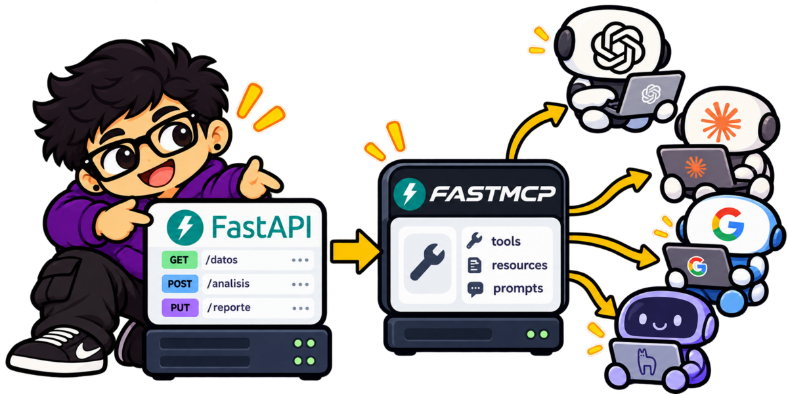
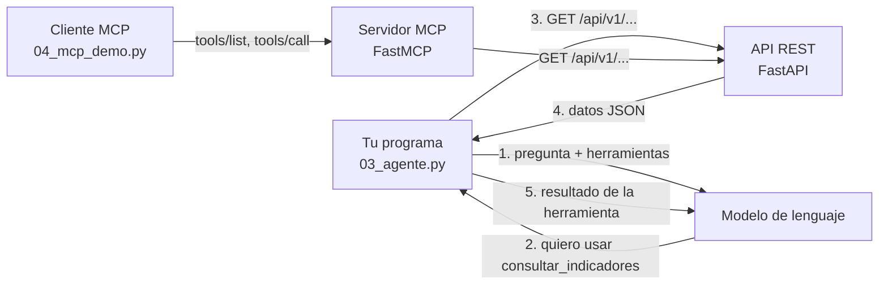

<p align="center">
  
</p>

<h1 align="center">De una API a un agente de IA</h1>

<p align="center">
  <b>Taller del IIEG:</b> construye tu primer agente de IA con Python, paso a paso, y publica sus herramientas con MCP.
</p>

<p align="center">
  
  
  
  
  
</p>

---


### ¡Bienvenida, bienvenido!

En este taller vas a ver, con código corto y trazas visibles, cómo un modelo de lenguaje deja de ser «solo un chat» y se convierte en un **agente** capaz de consultar datos reales de una API.

Usaremos indicadores de **9 municipios del Área Metropolitana de Guadalajara**: agua, residuos, reciclaje, áreas verdes, calidad del aire y transporte público.

> [!IMPORTANT]
> Todos los números son **datos sintéticos** inventados para el taller. **No** son estadísticas oficiales del IIEG.

<br clear="right">

## El recorrido

| Etapa | Programa | Lo que vas a descubrir |
|:---:|---|---|
| **1** | [`01_chat.py`](student/01_chat.py) | Un LLM conversa, pero **no conoce** ni consulta los datos. |
| **2** | [`02_api.py`](student/02_api.py) | Una API REST ya resuelve el acceso a los datos, **sin IA**. |
| **3** | [`03_agente.py`](student/03_agente.py) | El modelo **elige** una herramienta y **tu programa** la ejecuta. |
| **4** | [`04_mcp_demo.py`](student/04_mcp_demo.py) | Las mismas herramientas publicadas como servidor **MCP**. |

<p align="center">
  <a href="student/README.md"><b>Empieza aquí: guía del alumno</b></a>
  &nbsp;·&nbsp;
  <a href="student/PREGUNTAS.md"><b>Guía de preguntas</b></a>
  &nbsp;·&nbsp;
  <a href="https://ai-jalisco.datzin.com.mx/api/docs"><b>Explorar la API</b></a>
</p>

## Cómo encaja todo

<p align="center">
  
</p>



La idea central: **el modelo nunca ejecuta nada ni escribe URLs**. Solo pide una herramienta por su nombre; tu programa valida la petición, llama a la API y le devuelve el resultado.

## ¿Qué hay en este repositorio?

```text
AI-Jalisco/
├── student/            Lo que usarás en el taller (empieza por su README)
├── api/                API REST de indicadores hecha con FastAPI
│   └── data/           Datos sintéticos en JSON (generados con api/gen_data.py)
├── mcp_server/         La misma API publicada como herramientas MCP con FastMCP
├── tests/              Pruebas automáticas de la API y del servidor MCP
└── assets/             Imágenes
```

<details>
<summary><b>Para curiosos: correr la API y el servidor MCP en tu computadora</b></summary>
<br>

```bash
python -m venv .venv && source .venv/bin/activate     # Windows: .\.venv\Scripts\Activate.ps1
pip install -r requirements.txt pytest

python -m pytest -q tests                                   # pruebas
uvicorn api.main:app --port 8000                            # API: http://127.0.0.1:8000/api/docs
API_URL=http://127.0.0.1:8000 uvicorn mcp_server.server:app --port 8001   # MCP: http://127.0.0.1:8001/mcp
```

Compara [`api/main.py`](api/main.py) con [`mcp_server/server.py`](mcp_server/server.py): el servidor MCP no duplica la lógica, solo envuelve cada endpoint de la API como una herramienta.
</details>

---

<p align="center">
  
  <br>
  <sub>Instituto de Información Estadística y Geográfica de Jalisco · Taller de agentes de IA, 2026</sub>
</p>
